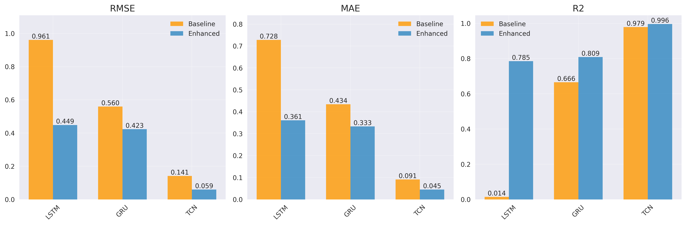
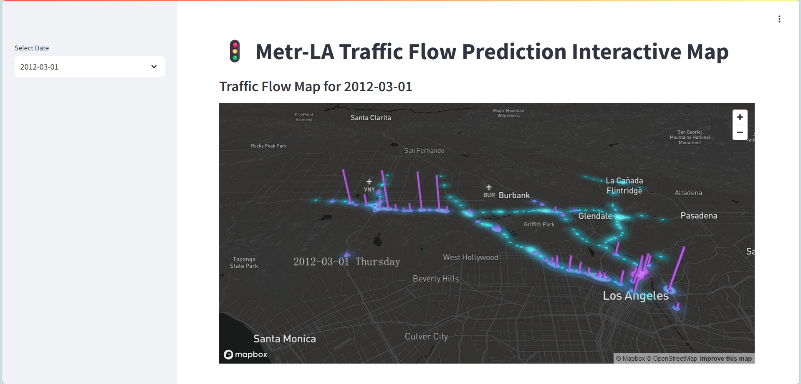

# Traffica: Traffic Flow Forecasting System that Integrates Weather Data

Traffica is a deep learning-based traffic flow forecasting system that integrates weather data to significantly improve prediction accuracy. The system supports multiple deep learning models, provides a comprehensive experimental framework, and offers rich visualization and reproducible research support.

---

## Features

- **Weather + Traffic Data**: Integrates weather and traffic data for better predictions.

- **Multiple Models**: Supports LSTM, GRU, TCN, and weather-integrated versions.

- **Automatic Experiments**: Runs and logs experiments automatically.

- **Rich Visualization**: Provides static and interactive result plots.

- **Reproducible**: All results and settings are saved for repeatability.

---

## Quick Start

1. **Environment Setup**
   - Conda:  
     `conda env create -f environment.yml && conda activate traffica`
   - Or pip:  
     `pip install -r requirements.txt`
2. **Token Setup**
   - Some features (such as map visualization or weather data) require you to provide your own API token. Please fill in your token in `streamlit_map.py` as instructed in the code comments.
3. **Run Experiments**
   - `python launch.py`
4. **Interactive Visualization**
   - `streamlit run streamlit_map.py`  
     Open http://localhost:8501 in your browser.

---

## Project Highlights

### Model Performance Overview


*Comparison of key metrics (RMSE, MAE, R²) for baseline and weather-enhanced models.*

### Traffic Map Visualization


*Visualization of traffic flow on the map.*

---

## Project Structure

```
Traffica/
├── data/                # Datasets (raw, processed, completed)
├── src/                 # Source code (models, utils, analysis, main, etc.)
├── results/             # Experiment results and visualizations
├── logs/                # Experiment logs
├── requirements.txt     # Python dependencies
├── environment.yml      # Conda environment
├── streamlit_map.py     # Interactive map visualization (Streamlit)
├── launch.py            # Experiment launcher
└── README.md            # Project documentation
```

---

## Main Modules

- `config.py`: Centralized configuration
- `data_utils.py`: Data loading, preprocessing, feature engineering, and splitting.
- `models.py`: Baseline and enhanced deep learning models.
- `analysis.py`: Model evaluation, statistical analysis, and visualization.
- `utils.py`: Utility functions (metrics, plotting, etc.).
- `btmf_fill.py`: Fill missing values. 
- `main.py`: Main experiment pipeline (training, evaluation, logging).
- `streamlit_map.py`: Interactive traffic map visualization using Pydeck and Streamlit.

---

## Visualization

- **Static**: Training curves, prediction vs. ground truth, error distributions, model comparison.
- **Interactive**: Daily traffic flow map with weather impact, using Streamlit (`streamlit_map.py`).

---

## Requirements

- Python 3.8+
- See `requirements.txt` or `environment.yml` for all dependencies (TensorFlow, PyTorch, scikit-learn, pandas, numpy, matplotlib, seaborn, pydeck, streamlit, etc.)
- GPU recommended for training

---

## Acknowledgements

I would like to thank the authors and contributors of the models and datasets utilized in this project. Their work has been fundamental to the development and success of Traffica.

---

## Contact

For questions, suggestions, or collaboration opportunities, please contact us via:
Email: nakano9331@Gmail.com


