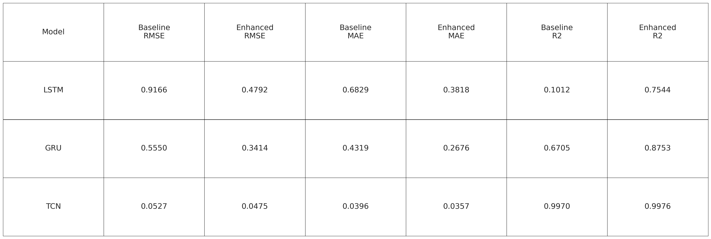

# Traffica: Traffic Flow Forecasting System Enhanced by Weather Data

Traffica is a deep learning-based traffic flow forecasting system that integrates weather data to significantly improve prediction accuracy. The system supports multiple deep learning models, provides a comprehensive experimental framework, and offers rich visualization and reproducible research support.

---

## Features

- **Multi-model Support**: LSTM, GRU, TCN (both baseline and weather-enhanced variants) for comparative analysis.
- **Weather Data Integration**: Incorporates temperature, precipitation, wind speed, humidity, and more.
- **GPU-Accelerated Training**: Optimized for NVIDIA RTX GPU.
- **Automated Experiments**: Baseline vs. enhanced models, with full experiment logging.
- **Rich Visualization**: Data analysis, model performance, training process, and interactive map visualizations.
- **Reproducibility**: All experiments and results are logged for reproducibility.

---

## Quick Start

1. **Environment Setup**
   - Conda:  
     `conda env create -f environment.yml && conda activate traffica`
   - Or pip:  
     `pip install -r requirements.txt`
2. **Run Experiments**
   - `python launch.py`
3. **Interactive Visualization**
   - `streamlit run streamlit_map.py`  
     Open http://localhost:8501 in your browser.

---

## Project Highlights

### Model Performance Overview


*Comparison of key metrics (RMSE, MAE, R²) for baseline and weather-enhanced models.*

### Performance Table


*Tabular summary of model performance across different metrics and configurations.*

---

## Project Structure

```
Traffica/
├── data/                # Datasets (raw, processed, completed)
├── src/                 # Source code (models, utils, analysis, main, etc.)
├── results/             # Experiment results and visualizations
├── logs/                # Experiment logs
├── requirements.txt     # Python dependencies
├── environment.yml      # Conda environment
├── streamlit_map.py     # Interactive map visualization (Streamlit)
├── launch.py            # Experiment launcher
└── README.md            # Project documentation
```

---

## Main Modules

- `config.py`: Centralized configuration (hyperparameters, paths, random seed, etc.)
- `data_utils.py`: Data loading, preprocessing, feature engineering, and splitting.
- `models.py`: Baseline and enhanced deep learning models (LSTM, GRU, CNN-LSTM, etc.)
- `analysis.py`: Model evaluation, statistical analysis, and visualization.
- `utils.py`: Utility functions (metrics, plotting, etc.)
- `main.py`: Main experiment pipeline (training, evaluation, logging).
- `streamlit_map.py`: Interactive traffic map visualization using Pydeck and Streamlit.

---

## Visualization

- **Static**: Training curves, prediction vs. ground truth, error distributions, model comparison.
- **Interactive**: Daily traffic flow map with weather impact, using Streamlit (`streamlit_map.py`).

---

## Requirements

- Python 3.8+
- See `requirements.txt` or `environment.yml` for all dependencies (TensorFlow, PyTorch, scikit-learn, pandas, numpy, matplotlib, seaborn, pydeck, streamlit, etc.)
- GPU recommended for training


